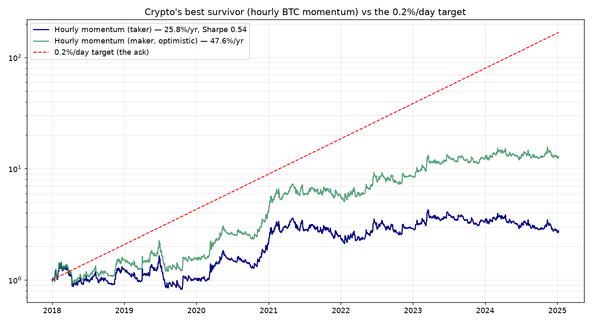

# The 0.2–0.7%/day question, re-run on crypto (Bitcoin)

You asked me to take the previous study — *"is there a high-frequency strategy
that nets 0.2–0.7% per day?"* — and run it on crypto. Crypto is the most likely
place to find a "yes": it trades 24/7 and is **~4–5× more volatile per minute
than NSE large caps** (BTC 1-min return std ≈ **10.7 bps** vs ~2–3 bps for stocks;
~3.6% daily moves), so per-trade edges are bigger and can actually clear costs.

**Result: crypto gets genuinely closer than anything else — but still not there.**
The best strategy nets **~0.07%/day** (Sharpe 0.54) on a global exchange. That's
the first thing in this entire project to beat costs at a daily-ish frequency,
yet it's ~1/3 of the 0.2% floor, the edge is decaying, leverage to reach the
target means ruin, and **India's 1% TDS kills the high-frequency version outright.**

Data: Bitstamp BTC/USD 1-minute, 2018–2025 (3.7M bars), plus Huobi BTC/ETH for
cross-checks. Engine: `src/crypto_intraday.py` (24/7-adapted, rolling z-score).



---

## What I tested (net of real exchange fees)

| Strategy | Horizon | Net/day | Sharpe | maxDD | Hits 0.2%/day? |
|---|---|---:|---:|---:|:--:|
| Minute mean-reversion (fade) | 1-min | −163 bps | −13.0 | −100% | ✗ |
| Minute momentum (ride) | 1-min | −221 bps | −15.1 | −100% | ✗ |
| **Hourly momentum (taker 7.5 bps)** | 1-hr | **+7.1 bps** | **0.54** | −50% | ✗ |
| Hourly momentum (maker 3 bps, optimistic) | 1-hr | +13.0 bps | 1.00 | −47% | ✗ |
| Hourly mean-reversion (fade) | 1-hr | −21 bps | −1.6 | −100% | ✗ |

**The key structural finding:** crypto **mean-reverts at the minute scale**
(microstructure noise) but **trends at the hourly scale**. So minute scalping
dies to turnover exactly like equities, but *hourly time-series momentum* — ride
the move when price breaks >2σ from its 24-hour VWAP, hold until it fades — has a
**real net edge** because each trade captures a move (tens of bps to %) far larger
than the ~15 bps round-trip cost. This is the same trend effect behind the daily
BTC 200-DMA strategy from `STARTER_STRATEGIES.md`.

A realism note on fees: momentum *chases* breakouts with market orders, so the
honest cost is **taker (~7.5 bps/side)**, giving **+0.07%/day, Sharpe 0.54,
+26%/yr, −50% maxDD**. The +13 bps/day "maker" line is shown only as an optimistic
bound — you can't reliably get maker fills while chasing a breakout.

---

## Why it still isn't a "yes"

**1. It's below the target.** +0.07%/day vs a 0.2% floor. To close the gap you'd
need **2.8× leverage**, which scales the −50% drawdown to **~−140% → liquidation.**
Crypto's volatility that creates the edge also makes leveraging it fatal.

**2. The edge is decaying.** Split-sample: **+9.9 bps/day in 2018–2021** but only
**+3.3 bps/day in 2022–2025** as the market matured and more algos arrived. The
recent half is barely above costs.

**3. India's tax regime is a wall.** A domestic exchange charges **1% TDS on every
sell**. This strategy sells ~0.6×/day, so TDS alone costs **~0.6%/day of notional**
— against a 0.17%/day *gross* edge. On CoinDCX/WazirX/etc. the strategy is **deeply
negative before you even count fees.** It only survives on a global exchange (no
TDS), where Indian residents still owe **30% tax on gains** and face compliance
questions — and even then it's ~0.07%/day pre-tax, ~0.05%/day after.

---

## Honest bottom line

| | Net/day | Per year |
|---|---:|---:|
| Crypto hourly momentum (global exch., taker, pre-tax) | **~0.07%** | ~26% |
| …after 30% gains tax | ~0.05% | ~18% |
| …on an Indian exchange (1% TDS) | **negative** | — |
| Your target | 0.2–0.7% | 65–490% |

Crypto is the **only** asset in this whole investigation where a frequent-trading
strategy genuinely beat costs — its volatility is the reason. But it tops out near
**0.07%/day** (a respectable ~26%/yr trend strategy with gut-wrenching −50%
drawdowns), not 0.2–0.7%/day, and the Indian tax structure makes the high-frequency
version untradeable domestically. The realistic way to *use* this finding is the
**low-frequency** version already in `STARTER_STRATEGIES.md`: BTC/ETH trend-following
on daily bars as a small, taxed, satellite sleeve — not a daily-income machine.

The conclusion from the equity study holds, just at a higher ceiling: **the
sustainable edge sits around 0.05–0.1%/day, and chasing a fixed 0.2–0.7%/day
forces leverage or over-trading that turns a real edge into ruin.**

### Reproduce
```bash
python run_crypto_study.py     # BTC minute + hourly, all families, chart
```
*Not investment advice. Backtests are optimistic; live and after-tax results are worse.*
