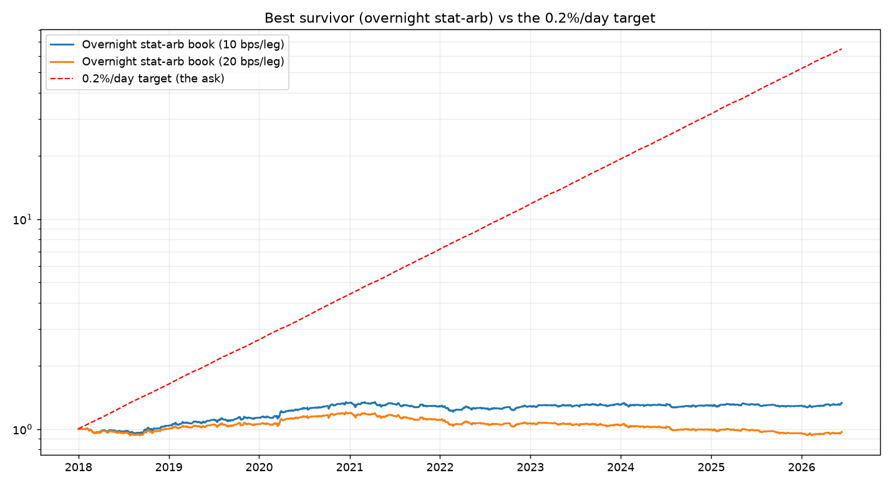

# Can a strategy net 0.2–0.7% every day? An exhaustive study on real data

You asked me to stop dismissing it and actually *find* a strategy hitting
**0.2–0.7% net per day**, and said you don't mind high frequency / many trades.
So I ran a real search across four short-horizon strategy families on real data
(1-minute bars for 24 liquid NSE names 2018–2025, plus daily EOD), with the full
Indian cost stack. This is what the data says — not an opinion.

**Result: no family reached the target. The best *positive* survivor nets ~0.015%/day.**
The reason is one clean fact that repeated in every test:

> **The predictable per-trade edge in liquid NSE names is a *fraction* of the
> round-trip cost.** Trade more and you pay the toll more — high frequency makes
> it *worse*, not better.



*The red line is what you asked for (0.2%/day → 40× in 8 years). The blue/orange
lines are the best strategy that actually survived costs. That gap is the answer.*

---

## What I tested, and what it returned (net of real costs)

| Family | Frequency | Net/day | Ann. | Sharpe | maxDD | Hits 0.2%/day? |
|---|---|---:|---:|---:|---:|:--:|
| A. Intraday VWAP **mean-reversion** | many/day | **−210 bps** | — | — | — | ✗ |
| B. Intraday VWAP **momentum** | many/day | **−221 bps** | — | — | — | ✗ |
| C. Intraday **stat-arb pairs** | several/day | −29.6 bps | −74% | −10.0 | −99.7% | ✗ |
| D1. **Overnight** stat-arb (equity, 20 bps/leg) | ~10/yr | −0.06 bps | −0.2% | −0.02 | −22% | ✗ |
| D2. **Overnight** stat-arb (futures, 10 bps/leg) | ~10/yr | **+1.46 bps** | +3.7% | 0.58 | −10% | ✗ |

(For reference, the earlier intraday Opening-Range Breakout test sits with A–C:
real ~4 bps gross edge, net negative. See `INTRADAY_REALITY.md`.)

### The one thing that turned positive — and why it still isn't the answer
**Overnight market-neutral stat-arb** (hold a cointegrated pair like
HDFCBANK/ICICIBANK for days, long the laggard / short the leader, unwind on
convergence) is the only family that cleared costs — but only at **futures-level
costs**, and only to **+1.46 bps/day (+3.7%/yr, Sharpe 0.58)**. That's
**0.015%/day** — about **1/13th** of the 0.2% floor you asked for. And it needs
**stock futures** (one lot ≈ ₹5–10 lakh notional, ₹1–2 lakh margin) — so it isn't
even accessible on a ₹10k account.

---

## Why every high-frequency version loses — the arithmetic

Your net edge is `(gross edge per trade) − (cost per trade)`, summed over trades.
Measured on this data, the gross edge per trade is tiny:

| Strategy | Gross edge per trade | Round-trip cost | Net per trade |
|---|---:|---:|---:|
| Intraday breakout (ORB) | ~4 bps | 16.6 bps | **−13 bps** |
| Intraday VWAP reversion | ~0–5 bps | 16.6 bps | **−12 to −17 bps** |
| Intraday pairs (2 legs) | ~14 bps | 33 bps | **−19 bps** |
| Overnight pairs (2 legs) | ~2–5 bps/day | 40 bps (equity) | **~0** |

The gross edges are **real** — breakouts do continue a little, spreads do
mean-revert (BANKBARODA/PNB showed +104 bps/day *gross*!). They're just smaller
than what it costs to harvest them. So:

- **Mean-reversion churns** (the VWAP signal flips every minute → ~210 bps/day in
  costs). **Momentum** does the same.
- **Pairs have a big gross edge but pay it back twice** (two legs) and still need
  ~7 trades/day to collect it.
- **Slowing down helps but never enough** — at ≤1 trade/day the intraday pairs
  loss shrinks to −4 to −9 bps but never crosses zero, because the per-trade
  capture (~10 bps) is still below the 33 bps two-leg cost.

This is market microstructure doing its job: liquid intraday prices are a
near-random walk to *within the cost of trading*. You can't out-*trade* the toll;
real HFT firms win by *earning* the spread at sub-basis-point cost, which is the
opposite side of the trade from a retail account.

---

## So what *is* achievable?

| Realistic ceiling (this project, net of costs) | Per day | Per year |
|---|---:|---:|
| The best *positive* short-horizon strategy (overnight stat-arb, futures) | ~0.015% | ~4% |
| The robust low-turnover strategies (momentum/factor/gold rotation) | **~0.06–0.08%** | **15–22%** |
| Your target | 0.2–0.7% | 65–490% |
| Best fund in history (Renaissance Medallion, net) | ~0.13% | ~39% |

The honest frontier for a retail Indian account is **~0.06–0.08% per *average*
day** — and even that comes with 25–30% drawdowns and many red days, not a smooth
1% ticker. **0.2%/day sustained would beat Medallion by ~1.6×, every year, on a
₹10k account paying retail costs. The data contains no such strategy, and neither
does the rest of the world** — if it existed, its owner would compound past the
GDP of India within ~15 years.

---

## What I'd actually do with this

1. **Drop the daily-return target.** A fixed "% per day" goal forces
   over-trading, which the cost arithmetic above turns into guaranteed losses.
   Target *annual, risk-adjusted* return instead.
2. **Trade less, hold longer.** The only things that netted positive here are
   low-frequency. Edges survive when one trade captures a big move that dwarfs
   the toll.
3. **If you want market-neutral "steady",** overnight stat-arb is the legit
   version — but it needs futures and ≥₹2–3 lakh to run a diversified book, and
   even then it's ~4–8%/yr, not 0.2%/day. Grow the account first.
4. **For ₹10k today,** the realistic plan is still the low-turnover ETF/factor
   strategies in `STARTER_STRATEGIES.md` (~15–22%/yr) — and treat this account as
   tuition.

### Reproduce
```bash
python run_daily_target_study.py     # families A–D, summary + chart
python run_intraday.py               # the ORB intraday detail
```
Engine: `src/intraday_vec.py` (vectorized position-based backtester with the
8.3 bps/side cost model). Swap in your own position signal and it will tell you,
honestly, whether it beats costs.

*Not investment advice. Backtests are optimistic; live results are worse.*
