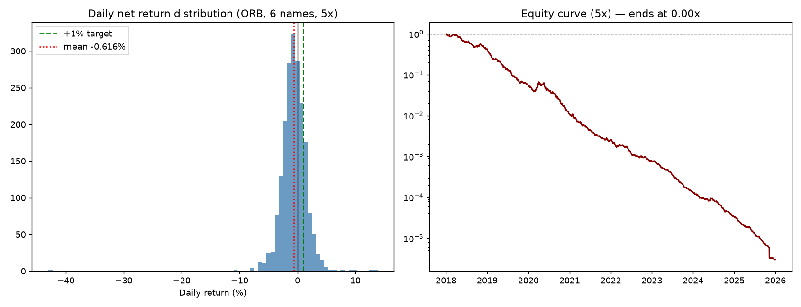

# Can an intraday strategy make 1% a day? A real test on 1-minute NSE data

You asked for a strategy that makes ~1%/day and said you're happy to trade at
high frequency. I built a proper intraday testbed to answer it honestly — real
1-minute bars, the real Indian cost stack — instead of guessing.

**Verdict: no.** The canonical retail "1%/day" strategy (Opening-Range
Breakout) has a *real but tiny* edge that is **smaller than the cost of
trading**, so it loses money net on every liquid name tested, across every
parameter setting. Trading more often makes it worse. Leverage makes the
+1% days *more frequent* while driving the account to **zero**.

This is the single most important lesson in trading, shown with data.

---

## The test

- **Data:** 1-minute OHLCV for 6 liquid large-caps (RELIANCE, HDFCBANK,
  ICICIBANK, INFY, SBIN, TATASTEEL), 2018–2025 (~750k bars each), from the
  `ganeshbiyer/Nse_Historical_Data` dataset.
- **Strategy:** Opening-Range Breakout — take the high/low of the first 15
  minutes; go long on a break above, short on a break below; exit at a 1R
  target, 1R stop, or square off at 15:15. One trade per name per day.
- **Cost model (real):** discount-broker brokerage (0.03% / ₹20 cap), STT
  (0.025% sell), exchange + SEBI + stamp charges, 18% GST, and a modest 3 bps/side
  slippage. On a ₹50,000 intraday position this is **16.6 bps round-trip** — and
  on a ₹10k account run at 5× MIS leverage, that's **0.83% of your capital gone
  per trade, before the market moves at all.**

## The result

| Symbol | Trades | Win % | Gross edge | Cost | **Net edge/trade** |
|---|---:|---:|---:|---:|---:|
| RELIANCE | 1,936 | 49.3% | +6.1 bps | 16.6 bps | **−10.5 bps (−₹53)** |
| SBIN | 1,937 | 49.5% | +6.0 bps | 16.6 bps | **−10.7 bps (−₹53)** |
| ICICIBANK | 1,940 | 47.8% | +4.2 bps | 16.6 bps | **−12.4 bps (−₹62)** |
| TATASTEEL | 1,913 | 48.2% | +3.7 bps | 16.6 bps | **−13.0 bps (−₹65)** |
| HDFCBANK | 1,905 | 46.0% | +3.1 bps | 16.6 bps | **−13.5 bps (−₹68)** |
| INFY | 1,858 | 45.6% | +2.4 bps | 16.6 bps | **−14.2 bps (−₹71)** |

The breakout edge is **genuinely positive gross** (~4 bps/trade — breakouts do
continue slightly). It just isn't *remotely* big enough to pay the 16.6 bps toll.
Net, every name bleeds ~₹50–70 per trade.

### Does it ever clear +1% a day?

| Metric (pooled 6-name book) | At 1× | At 5× leverage |
|---|---:|---:|
| Mean daily return | −0.12% | −0.62% |
| % of days ≥ **+1%** | 0.6% | **18.9%** |
| % positive days | 35.9% | 35.9% |
| Worst day | −8.6% | −43.0% |
| **₹10k after 8 years** | ₹860 (−91%) | **₹0 (−100%)** |

Look closely at the trap: **at 5× leverage, 19% of days DID make +1% or more.**
If you cherry-picked those days for a screenshot, it would look like a winning
system. But the full distribution has a negative mean, so compounding marches
the account straight to zero. *Frequent +1% days are not the same as
profitability* — and leverage, which seems to "get you to 1% faster," simply
guarantees the ruin arrives faster too.



*Left: the daily-return histogram is centred just left of zero, with a real
right tail of +1% days. Right: the 5× equity curve (log scale) is a near-straight
line to zero.*

### No parameter setting rescues it

Sweeping the two names with the **best** gross edge (RELIANCE, SBIN):

| Config | Trades | Gross | **Net** |
|---|---:|---:|---:|
| OR15, 1R/1R | 3,391 | +4.3 bps | −12.3 bps |
| OR30, 2R/1R | 3,296 | +7.0 bps | −9.6 bps |
| **OR60, 2R/1R** | 3,069 | **+11.3 bps** | **−5.3 bps** |
| OR15, 3R/1R | 3,391 | +5.7 bps | −10.9 bps |
| OR15, long-only | 2,203 | +1.7 bps | −14.9 bps |

Slowing down (longer range, wider targets, fewer trades) is the *right*
direction — gross edge per trade rises to 11 bps and cost is paid less often —
but even the best variant is still **−5.3 bps net**. To get positive you'd need a
signal with **>16.6 bps of gross edge per trade**, which plain price-breakouts
simply don't have. And note: the "fix" is to trade *less*, the opposite of HFT.

---

## Why high frequency is the wrong instinct here

Every trade pays the toll. Your net edge is `gross_edge_per_trade −
cost_per_trade`, summed over trades. If gross edge per trade is below cost (it is,
for any simple price rule on liquid names), then **more trades = more guaranteed
loss**. Real HFT firms invert this: they *earn* the spread (they're the ones you
pay) and their costs are a fraction of a basis point thanks to co-location and
exchange rebates. As a retail trader you are structurally on the paying side of
that trade. You cannot out-trade the toll; you can only trade less and bigger.

This is the same result we found earlier in this project at the weekly horizon
(the "5/10" strategy: positive gross, killed by costs). It is not specific to one
strategy — it's the arithmetic of costs.

---

## What to do with this testbed

The harness is reusable — point it at your own idea before risking a rupee:

```bash
python run_intraday.py                      # runs the ORB example
```

To test a different rule, edit `src/intraday.py`: the cost model
(`roundtrip_cost_frac`) and reporting (`per_trade_stats`, `daily_stats`) are
generic; write a new `backtest_*` that emits per-trade `gross_ret`/`net_ret` and
the same reports will tell you, honestly, whether it survives costs.

**The bar any intraday idea must clear:** an average **gross** edge above ~16 bps
per trade on liquid names (more on illiquid ones). If a backtest can't show that
*after* realistic slippage, the strategy is a cost-generator, not an income
source — no matter how good the win-rate screenshot looks.

**Where the real, survivable edge was** in this whole project: low-turnover,
multi-day strategies where costs are amortised over big moves — the momentum
rotation / factor / gold strategies in `STARTER_STRATEGIES.md` (15–22% *per year*,
i.e. ~0.05–0.08% per day on average, without blowing up). That is the realistic
shape of "consistent profit." 1%/*day* isn't a strategy — it's the bait.

*Not investment advice. Backtests are optimistic; live trading is worse.*
