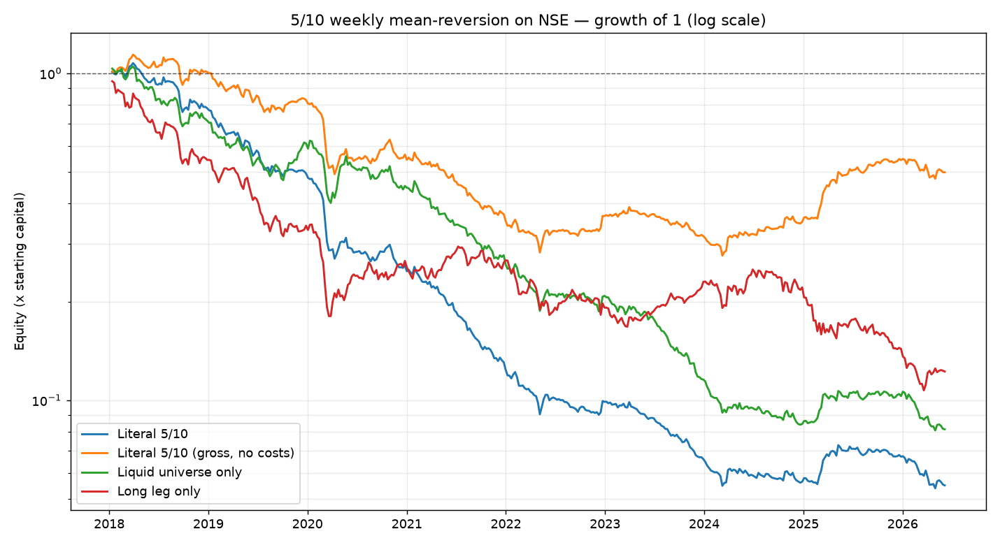
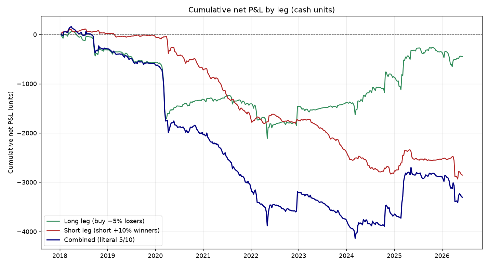
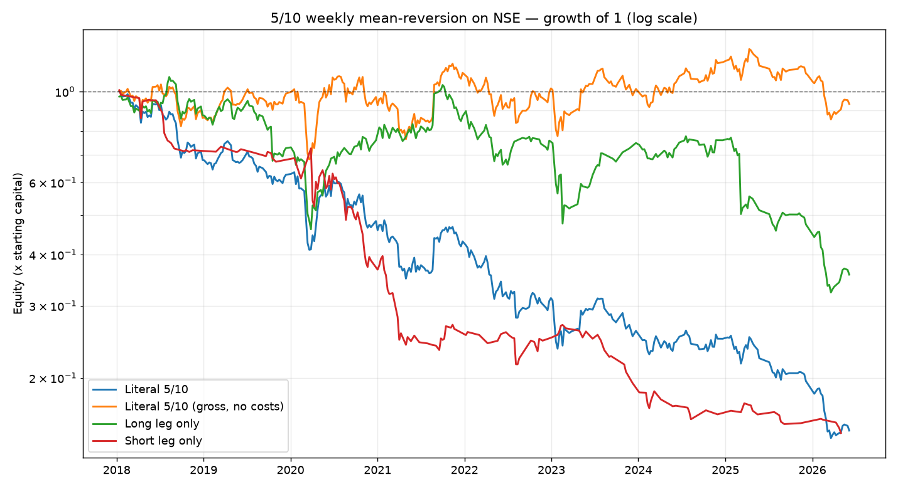

# Backtesting the "5/10" weekly mean-reversion strategy on Indian equities (NSE)

This repo backtests the statistical-arbitrage strategy described by HFT trader
**Manu Narang** — applied to the **Indian (NSE) market** instead of the US.

> **The strategy, in one line:** every week, across a huge universe of stocks,
> **buy a small fixed amount (`$5`) of any stock that fell ≥ 5% last week**, and
> **short a larger fixed amount (`$10`) of any stock that rose ≥ 10% last week**;
> hold one week, then repeat. The bet is that sharp weekly moves *mean-revert*,
> and the edge — tiny per name — is harvested across thousands of nearly
> independent micro-positions. Narang says it has "nearly as many losers as
> winners" yet "never a losing week or a losing month" over eight years.

**Headline result for India (NSE, Jan 2018 – Jun 2026, ~8.4 years): the strategy
does _not_ replicate.** As literally specified it loses money, and it loses even
*before* transaction costs on a capital-normalised basis. The reasons are
specific and instructive — see [Findings](#findings).

---

## TL;DR results

Backtest window **2018-01-12 → 2026-06-05** (439 weekly rebalances), universe of
**2,884 NSE stocks** (liquidity-filtered each week), 25 bps cost per side.

| Variant | Mean weekly return\* | Weekly win % | Monthly win % | Sharpe\* | Total net P&L (units) |
|---|---:|---:|---:|---:|---:|
| **Literal 5/10** (25 bps/side) | **−62.8 bps** | 34.4% | 24.8% | −1.82 | **−3,303** |
| Literal 5/10, **gross (0 cost)** | −12.8 bps | 45.6% | 47.5% | −0.37 | +234 |
| Liquid universe only | −45.5 bps | 39.9% | 29.7% | −1.37 | −628 |
| Long leg only (buy losers) | — | 44.4% | 43.6% | −0.81 | −450 |
| Short leg only (short winners) | — | ~38% | — | — | **−2,853** |

\* *"Return" and Sharpe are on a leverage-neutral, constant-deployed-capital
basis — see [Methodology → the capital convention](#the-capital-convention).
"units" are the strategy's own cash units (`$5` per long, `$10` per short).*

**Key takeaways**

1. **It loses money in India**, the opposite of Narang's US claim. There were
   plenty of losing weeks *and* losing months (monthly win rate ≈ 25%).
2. **The short leg is the disaster.** Shorting weekly +10% winners cost ~2,850
   units; the long leg (buying −5% losers) was roughly break-even (−450).
3. **Even with zero costs the per-capital edge is negative** (−12.8 bps/week).
   The strategy only shows a small *dollar* profit gross, and only because the
   literal fixed-cash-per-name sizing accidentally levers up into market crashes
   and is bailed out by the rebound. There is no robust edge to harvest.
4. **Transaction costs are decisive.** With ~109,000 round-trips, costs alone
   came to ~3,540 units. The break-even cost is essentially **0 bps** — and even
   that only on a gross *dollar* basis, not per unit of capital.
5. **Shrinking to Nifty 50 helps a lot** and shows the signal is *half* right:
   the long "buy-the-dip" leg has a real large-cap edge (Sharpe ~0.44 gross),
   while shorting winners stays a loser because large-caps trend. See
   [What if we shrink the universe to Nifty 50?](#what-if-we-shrink-the-universe-to-nifty-50).



---

## Why it fails — the diagnostic that matters

The acid test for mean reversion: bucket every stock by its **prior-week**
return and look at its **next-week** return.

| Prior-week bucket | # obs | Mean next-wk | **Median next-wk** | % positive |
|---|---:|---:|---:|---:|
| < −10% | 17,015 | +0.50% | **+0.45%** | 52.8% |
| −10…−5% | 59,943 | +0.35% | +0.04% | 50.2% |
| −5…−2% | 102,622 | +0.13% | −0.17% | 48.0% |
| −2…+2% | 213,767 | +0.21% | −0.05% | 48.5% |
| +2…+5% | 85,853 | +0.32% | −0.13% | 48.6% |
| +5…+10% | 55,238 | +0.29% | −0.38% | 46.5% |
| **> +10%** | 32,249 | **+0.39%** | **−0.68%** | 45.7% |

Read the **median** column and there *is* reversion: big losers bounce
(+0.45%), big winners pull back (−0.68%), and the share of names that rise falls
monotonically from 53% to 46% as you go from losers to winners. The signal's
*direction* is correct.

But the strategy trades the **mean**, and the mean tells a different story:

- **A positive market drift (~+0.2%/week) sits under everything.** It quietly
  helps the long leg and quietly fights the short leg.
- **Winners have a fat right tail.** The *typical* winner pulls back, but a
  minority keep exploding upward (momentum / short-squeezes). Shorting them is a
  **negatively-skewed** bet: many small wins, occasional huge losses. That tail,
  not the median, drives the mean to **+0.39%** — so shorting winners loses on
  average, and the `$10` (2×) size amplifies it.

So the strategy isn't betting on the wrong sign — it's that in Indian equities
the **drift + fat upside tails + transaction costs** overwhelm a real-but-thin
median reversion. The US version survives because at HFT scale you *earn* the
spread instead of paying ~50 bps round-trip, and you can manage the tail.



The long leg (green) actually recovers strongly after 2024 and spikes on every
crash-rebound; the short leg (red) bleeds almost monotonically. The combined
line is dominated by the short leg's losses.

---

## What if we shrink the universe to Nifty 50?

A natural follow-up: maybe the full ~2,900-name universe is too noisy and
costly, and the strategy behaves better in clean, liquid large-caps. We re-ran
it on the **Nifty 50** (49 names resolve in the dataset; same 2018–2026 window).
Reproduce with:

```bash
python run_backtest.py --daily-dir /unused --symbols-file data/nifty50.txt \
    --start 2018-01-01 --end 2026-06-12 --outdir output/nifty50
```

**This changes the picture a lot — and isolates where the edge actually lives.**
Large-caps rarely move ±5/±10% in a week, so signals are sparse (avg **4 longs /
1 short per week**), but the per-trade behaviour is much cleaner:

| Variant | Gross Sharpe | Gross weekly win % | Net Sharpe (25 bps) | Edge survives cost up to |
|---|---:|---:|---:|---:|
| **Long leg** (buy −5% losers) | **+0.44** | 55% | −0.33 (≈ break-even, +4.7 units) | **~10–12 bps/side** |
| Literal 5/10 (both legs) | +0.11 | 51% | −0.80 | ~5 bps/side |
| **Short leg** (short +10% winners) | **−0.79** | 41% | −1.51 | never (loses even gross) |

Forward-return diagnostic on Nifty 50 (next-week return by prior-week bucket):

| Prior-week bucket | mean next-wk | median next-wk | % positive |
|---|---:|---:|---:|
| < −10% | +0.69% | +1.19% | 55% |
| −10…−5% | +0.53% | +0.67% | 57% |
| **> +10%** | **+0.73%** | **+0.71%** | **57%** |

**Findings on the small universe:**

1. **The long "buy-the-dip" leg has a real edge in large-caps.** Nifty losers
   reliably bounce (a −5%…−10% week is followed by +0.53% on average, 57% of the
   time positive). Gross, the long leg runs at **Sharpe ~0.44** with a 59%
   *monthly* win rate — the closest thing here to Narang's "steady" profile.
2. **But it's thin, and costs decide it.** That edge is ~10–30 bps/week. It
   stays profitable only up to ~10–12 bps per side; at a retail 25 bps it is
   essentially break-even (+4.7 units over 7 years). You need
   institutional/HFT-level costs — exactly the environment Narang operates in —
   to bank it.
3. **The short "fade-the-rip" leg is simply wrong for large-caps.** Nifty 50
   winners *keep winning* (a +10% week is followed by another +0.73%): large-cap
   momentum, not reversion. Shorting them loses **even at zero cost** (Sharpe
   −0.79), and drags the combined strategy below break-even.
4. **Net effect:** shrinking the universe turns a catastrophic loser into a
   roughly break-even strategy *gross*, and shows the signal is half-right —
   keep the long leg, drop the short leg. The literal symmetric 5/10 still
   loses after realistic costs.

> Caveat specific to this cut: using *today's* Nifty 50 across all of 2018–2026
> bakes in membership look-ahead (these are the survivors), which flatters the
> long leg. And with only ~4 names a week the equity curve is noisy/undiversified
> — read the Sharpe and win-rate, not the compounded curve, which suffers
> volatility-drag from the tiny book. See `output/nifty50/`.



---

## Methodology

### Data
- **Source:** [`BennyThadikaran/eod2_data`](https://github.com/BennyThadikaran/eod2_data)
  — split/bonus-adjusted **NSE** end-of-day OHLCV, one CSV per symbol, ~3,400
  symbols, updated weekly. Pulled via [`scripts/fetch_data.sh`](scripts/fetch_data.sh).
- We keep the `EQ`/`BE` series, resample daily closes to **weekly (W-FRI)**
  closes, and compute weekly median daily turnover (`Close × Volume`) for the
  liquidity filter. Panels are cached to Parquet (committed under `data/`).

### Signals & sizing (faithful to the description)
- `prior_week_return ≤ −5%` → **long**, size **5** units.
- `prior_week_return ≥ +10%` → **short**, size **10** units.
- Positions are entered at the week's close and held exactly **one week**;
  P&L is the next week's return × signed size, minus costs. No look-ahead: the
  signal at week *t* uses only data through *t* and earns week *t+1*'s return.

### Tradable universe (applied every week, at signal time)
- Price ≥ ₹20 (no penny stocks), and
- median daily turnover over the trailing 4 weeks ≥ ₹25 lakh (≈ ₹2.5 M), and
- `|prior-week return| ≤ 60%` to discard un-adjusted corporate-action jumps.

This yields a few hundred names per week (avg **175 longs / 73 shorts**) — large
and diversified, in the spirit of the original, while remaining tradable.

### Costs
**25 bps per side (50 bps round-trip)** charged on each position's notional —
a deliberately middle-of-the-road estimate for a weekly *delivery* strategy in
India (STT ~10 bps on the sell, plus brokerage, exchange/SEBI/stamp charges, GST
and slippage across small/mid-caps). A [cost-sensitivity sweep](output/cost_sensitivity.csv)
from 0–40 bps is included.

### The capital convention
The literal strategy deploys a *fixed cash amount per name*, so weekly gross
exposure floats wildly (6 to 1,340 names/week). Compounding P&L over a fixed
capital base would inject volatility-drag that reflects **leverage, not edge**.
The headline returns/Sharpe/drawdown therefore use a **leverage-neutral,
constant-deployed-capital** basis (`net P&L ÷ capital actually deployed that
week`), which isolates the edge. Both conventions are emitted in
`output/weekly_literal.csv` (`ret_on_exposure` vs `ret_on_capital`).

> This convention also explains the one apparent contradiction in the numbers:
> gross *dollar* P&L is slightly **positive** (+234) while the gross *per-capital*
> return is **negative** (−12.8 bps/wk). The dollar figure is dominated by a few
> extreme high-exposure crash weeks (e.g. Mar-2020) whose rebounds pay off; per
> unit of capital, the average week loses. The dollar profit is an artefact of
> accidental leverage, not a harvestable edge.

### Robustness
- **Threshold grid** over long thresholds {−3,−5,−8,−10%} × short thresholds
  {+5,+8,+10,+15%}: **every** cell is negative (−50 to −71 bps/wk). No threshold
  choice rescues it. See [`output/threshold_grid.csv`](output/threshold_grid.csv).
- **Liquid-only** universe (turnover ≥ ₹20 cr): smaller losses but still clearly
  negative.

---

## Reproduce

```bash
pip install -r requirements.txt

# Option A — use the committed weekly cache (no download needed):
python run_backtest.py --daily-dir /unused --start 2018-01-01 --end 2026-06-12
#   (the cache at data/weekly.*.parquet is used automatically)

# Option B — refresh from source, then rebuild the cache:
bash scripts/fetch_data.sh                       # ~570 MB shallow clone
python src/data_loader.py eod2_data/daily --cache data/weekly --rebuild
python run_backtest.py --daily-dir eod2_data/daily --start 2018-01-01
```

Outputs land in `output/`: `summary.json`, `weekly_literal.csv`,
`monthly_returns_literal.csv`, the sensitivity/diagnostic CSVs, and the four
PNG charts.

### Layout
```
src/data_loader.py   load NSE CSVs -> cached weekly close/turnover panels
src/strategy.py      the 5/10 strategy engine (StrategyConfig + run_backtest)
src/metrics.py       performance metrics & monthly tables
src/analysis.py      cost sensitivity, threshold grid, forward-return diagnostic
run_backtest.py      CLI: runs all variants, writes artefacts and charts
tests/test_strategy.py  unit checks on the P&L accounting
```

---

## Caveats & honest limitations

- **Survivorship bias (optimistic).** The dataset is largely *currently-listed*
  NSE names; delisted/bankrupt stocks are under-represented. A loser-buying
  strategy is exactly the one that survivorship bias *flatters* — so the real
  long-leg result is likely **worse** than shown. This strengthens, not weakens,
  the negative conclusion.
- **Shorting frictions are understated.** Many NSE stocks are hard or impossible
  to borrow/short for a week, and stock-futures financing/availability is
  ignored. The real short leg would be even harder to run than modelled.
- **Fills are idealised** at the weekly close (no market impact beyond the flat
  cost, no liquidity cap per name).
- **One regime, one market.** Results cover NSE 2018–2026. They don't claim
  anything about the US book Narang actually runs, which operates at sub-bps
  cost as a liquidity provider — a fundamentally different cost structure.

**Bottom line:** the elegant "buy the dip, fade the rip" weekly reversion that
Narang describes for US markets does not survive contact with Indian equities
once realistic costs and the asymmetric short leg are included. The median
reversion signal is real but too thin to overcome drift, fat upside tails, and
~50 bps round-trip costs. Not investment advice; for research/education only.
