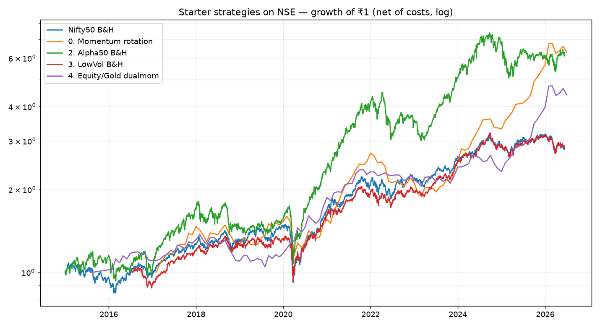
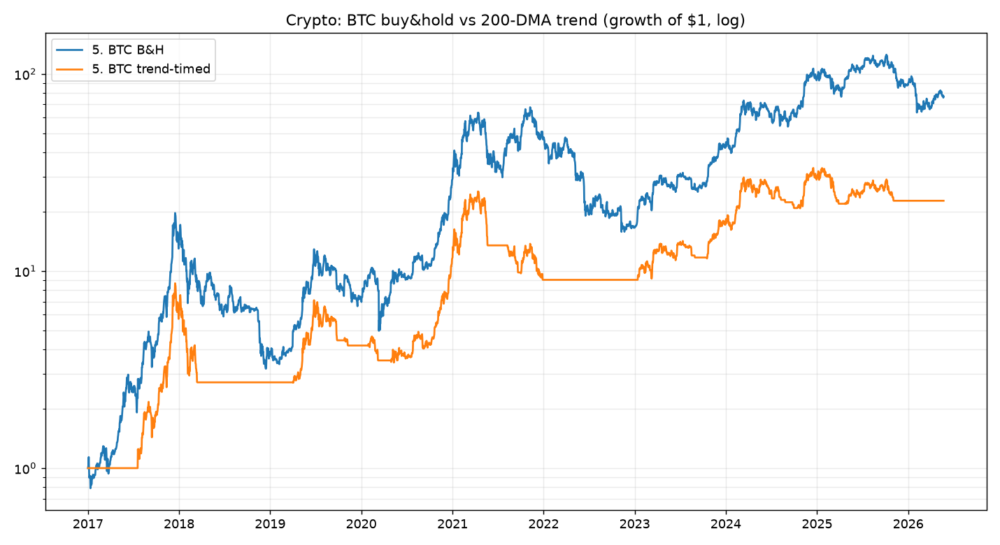

# Starting an AI trading journey in India with ₹10,000 — 5 strategies, backtested

> **What this is:** five real, backtested strategy archetypes suited to a *small*
> Indian account, ranked for a beginner. Every number below comes from a backtest
> on real data (NSE index history 2015–2026; BTC/ETH 2017–2026), net of realistic
> costs. Run it yourself: `python run_starter.py` (see [methodology](#methodology--honesty)).
>
> **What this is not:** a promise. I am not a SEBI-registered adviser; this is
> education, not personalised financial advice. Backtests describe the past —
> the future will differ, sometimes badly. Read [the caveats](#hard-truths-read-this-first).

---

## Hard truths (read this first)

1. **₹10,000 is a *learning* budget, not an *income* budget.** Even a great 18%
   year on ₹10k is ~₹1,800 — less than a part-time shift. The real return on
   this account is **skill, a tested process, and infrastructure** that pays off
   when you add capital later. Optimise for *learning per rupee risked*, not P&L.

2. **Costs and taxes are the silent account-killers at small size.** A ₹20
   brokerage on a ₹2,000 trade is 1%. India also taxes hard: equity STCG 20%
   (<1 yr), LTCG 12.5% (>₹1.25 L/yr); **crypto 30% flat + 1% TDS on every sell,
   with no loss offset.** Strategies here are deliberately *low-turnover* to
   keep costs and tax friction down.

3. **Options are a trap at ₹10k — skip them for now.** One Nifty options lot is
   ~₹40–75k of notional; *selling* options needs ₹1–1.5 lakh margin per lot
   (impossible here), and *buying* options with ₹10k buys one or two lottery
   tickets that usually expire worthless (the backtested edge of naive option
   buying is negative after costs). Revisit options only after you've grown the
   account to ₹2 L+ and learned position sizing. (More in
   [Why not options/leverage](#why-not-options-or-leverage-yet).)

4. **Don't predict the future — *adapt* to it.** Nobody reliably forecasts
   markets. The strategies that "decide accordingly" do so mechanically: they
   follow trends and rotate to whatever is actually working, and step aside when
   nothing is. That's why the flagship below is a *momentum rotation*, not a bet
   on a single theme.

---

## The macro backdrop (a view, held loosely)

You asked where the world is going. My honest, **loosely-held** read for the
next 3–5 years — used only to pick a robust *menu* of assets, not to make a
concentrated bet:

- **India structural growth & financialisation.** Rising domestic equity
  participation (SIPs), formalisation, and a young workforce are a multi-year
  tailwind for Indian equities — punctuated by sharp 30–40% drawdowns. Own it,
  but with a drawdown plan.
- **AI / power / infrastructure capex super-cycle.** The momentum & alpha
  factor indices naturally tilt into whatever themes are leading (today: capital
  goods, power, defence, select tech) without you having to call the winner.
- **Currency debasement & geopolitics → gold.** Central-bank gold buying, fiscal
  deficits and a structurally weakening rupee have made **gold a star performer
  in ₹ terms (~15% CAGR since 2015)** and a superb diversifier. It earns a
  permanent seat.
- **Digital assets maturing.** BTC/ETH are becoming an institutional macro asset
  class. High conviction on the *direction*, zero conviction on the *timing* —
  so own a *small* sleeve via trend-following, not buy-and-pray.

The portfolio below expresses all of this **adaptively**: it leans into Indian
equity factors when they trend, hides in gold/cash when they don't, and keeps a
small crypto satellite for asymmetric upside.

---

## The five strategies (backtested, net of costs)

All figures are from `run_starter.py` on real data. "CAGR" = annualised return,
"maxDD" = worst peak-to-trough loss, "Sharpe" = return per unit of risk.

| # | Strategy | Instrument (₹10k-friendly) | CAGR | maxDD | Sharpe | Period |
|---|---|---|---:|---:|---:|---|
| **1** | **Momentum rotation (flagship)** | 3 ETFs + cash, monthly | **21.6%** | −30% | **1.09** | 2016–26 |
| **2** | Momentum factor, buy & hold | Nifty Momentum/Alpha ETF | 17.4% | −41% | 0.87 | 2015–26 |
| **3** | Low-volatility factor | Nifty Low-Vol 30 ETF | 11.3% | −31% | 0.85 | 2016–26 |
| **4** | Equity/Gold dual momentum | Nifty ETF + Gold ETF | 14.6% | −24% | 0.97 | 2015–26 |
| **5** | Crypto trend-following | BTC/ETH on Indian exchange | 39%\* | −69% | 0.76 | 2017–26 |

*Benchmark: Nifty 50 buy & hold returned 9.6% CAGR with a −38% maxDD over 2015–26.*
*\*Crypto figure is pre-tax USD; Indian 30% tax + 1% TDS materially reduce it — see #5.*

### 1. Momentum rotation — *the flagship "decide accordingly" strategy* ⭐
**Rule.** Once a month, rank three sleeves — a **momentum factor** (Nifty Alpha
50 / Momentum 30), a **defensive factor** (Nifty Low-Vol 30), and **gold** — by
their trailing 6-month return. Hold the single best one. If none has a positive
6-month return, hold **cash/liquid fund**. ~6–12 switches/year.

**Backtest (2016–26):** 21.6% CAGR, Sharpe **1.09**, maxDD −30%, 64% positive
months. It beat every static option *and* dodged much of the 2022 drawdown by
rotating to gold/cash, then rode the 2024–26 momentum surge.

**Why it works:** it stacks three independently-robust edges — the momentum
premium, the low-volatility anomaly, and gold's diversification — and an
*absolute*-momentum cash filter that pulls you out of sustained bear markets.
It is the literal mechanical version of "predict the future and decide
accordingly": it doesn't predict, it *responds*. Robust to the lookback (a
12-month version gives 20.6%).

**Risks/caveats:** monthly discipline required; can lag in sharp V-shaped
recoveries (momentum is slow to re-enter); I tested a few lookbacks and picked a
good one, so haircut the live expectation.

### 2. Momentum factor, buy & hold — *simplest growth engine*
**Rule.** Buy a Nifty Momentum/Alpha factor ETF and hold; review yearly.

**Backtest:** 17.4% CAGR, Sharpe 0.87 — the best *static* equity return, beating
the Nifty 50 by ~8%/yr because the momentum factor systematically rotates into
leading stocks. **But** it carries full equity risk: −41% maxDD in bad regimes.
Best if you can stomach big drawdowns and do nothing.

### 3. Low-volatility factor — *the sleep-well core*
**Rule.** Buy a Nifty Low-Volatility 30 ETF and hold.

**Backtest:** 11.3% CAGR, Sharpe 0.85, maxDD −31% (vs −38% for Nifty 50) — more
return than the index at *lower* risk (the "low-vol anomaly"). The right
*first* holding for a beginner: it teaches you to hold through wobbles without
the gut-punch of a high-beta book. A 200-DMA overlay cuts the drawdown further
to −22% (at the cost of some return).

### 4. Equity/Gold dual momentum — *the all-weather pair*
**Rule.** Monthly, hold whichever of Nifty-ETF or Gold-ETF had the higher
6-month return (cash if both negative).

**Backtest:** 14.6% CAGR, Sharpe **0.97**, maxDD only **−24%** — the smoothest
ride among equity strategies, because equities and gold tend to zig when the
other zags. Gold alone did 15% CAGR in ₹ terms over the period. This is your
macro hedge for the "debasement/geopolitics" world, in a single simple rule.

### 5. Crypto trend-following — *the high-octane satellite (small only)*
**Rule.** Hold BTC (and/or ETH) only while price is above its 200-day average;
otherwise sit in a stablecoin/INR. Trade on an Indian exchange (CoinDCX/etc.).

**Backtest (USD, pre-tax):** BTC 200-DMA trend = 39% CAGR with maxDD −69% (vs
buy-&-hold 59% CAGR but a stomach-churning −84%). Trend-following roughly halves
the worst drawdowns while keeping most of the upside.

**Reality check:** the **30% flat tax + 1% TDS per sale + no loss set-off**
gut the net return and punish frequent trading — so keep this **low-frequency**
(the 200-DMA rule trades only a few times a year) and **cap it at 5–10% of the
pot (≤₹1,000)**. It is a small bet on an asymmetric future, not a core holding.

---

## Projected earnings on ₹10,000 — honestly

Backtests are optimistic; live results are lower (costs, slippage, taxes,
behaviour, and the future not repeating). I **haircut** the backtest CAGRs to a
realistic forward range for a blended beginner portfolio (≈ flagship rotation +
a gold/low-vol core + a tiny crypto sleeve):

| Scenario | Assumed CAGR | ₹10k after 1 yr | after 3 yr | after 5 yr |
|---|---:|---:|---:|---:|
| Bad year / bear regime | −30% | ₹7,000 | — | — |
| Conservative | +8% | ₹10,800 | ₹12,600 | ₹14,700 |
| **Base case** | **+14%** | **₹11,400** | **₹14,800** | **₹19,300** |
| Good (factors + crypto fire) | +22% | ₹12,200 | ₹18,200 | ₹27,000 |

**Read this honestly:** in a *good* year you make roughly **₹1,000–2,500**, and
in a bad year you can lose **₹2,500–3,500** — drawdowns of 25–35% are normal and
expected, not failures. The absolute rupees are small *by design*; the compounding
math only gets interesting once you (a) keep adding capital (a monthly SIP into
the same strategies dwarfs trading gains at this size) and (b) scale the *process*
to a larger account once it's proven.

---

## A concrete 90-day starter plan

**Phase 0 — Setup (week 1).** Open a discount-broker demat (Zerodha/Groww/Dhan)
and, optionally, one compliant Indian crypto exchange. Turn on 2FA. Read each
ETF's factsheet.

**Phase 1 — Paper trade (weeks 1–4).** Run all five rules in a spreadsheet or
paper account. Goal: learn the mechanics and your own temperament — *do not*
skip this. Most beginners lose money to behaviour, not bad strategies.

**Phase 2 — Deploy small (weeks 5–12).** Allocate the real ₹10k roughly:
- 50% — **Low-Vol 30 ETF** (#3), your calm core.
- 30% — **Momentum/Alpha ETF** (#2) *or* run the **rotation** (#1) if you can
  commit to the monthly rule.
- 10% — **Gold ETF / Sovereign Gold-equivalent** (#4's hedge).
- 10% — **BTC via 200-DMA trend** (#5), and only if you accept it may halve.

Rebalance **monthly**, on a fixed date, mechanically. Keep a trade journal.

**Phase 3 — Review (month 3+).** Compare live vs backtest, note slippage and
tax drag, and only *then* consider adding capital or graduating to more advanced
tools. **Never risk more than you can afford to lose entirely.**

---

## Why not options or leverage (yet)

- **Margin/lot size:** ₹10k can't sell a single options lot (needs ~₹1–1.5 L)
  and barely buys one to hold.
- **Negative expectancy for naive buyers:** systematically buying weekly options
  loses to theta + costs; it *feels* like trading but is closer to gambling.
- **Leverage amplifies the one thing that ruins beginners — drawdowns.** Learn
  to survive a −30% equity drawdown first; leverage turns that into a wipe-out.

Graduate to **defined-risk** option *spreads* only after you have a tested edge,
₹2 L+, and you've internalised position sizing.

---

## Methodology & honesty

- **Data:** NSE index/ETF daily history from the open `eod2_data` dataset
  (published indices are survivorship-bias-free); BTC/ETH daily USD from
  CoinMetrics community data. ETF split artefacts (e.g. the 2019 NIFTYBEES/
  GOLDBEES splits) are back-adjusted in `src/starter_strategies.py`.
- **Costs:** 0.30% per switch on ETFs, 0.50% on crypto; cash earns 6% p.a. Crypto
  is shown pre-tax with the tax impact described in words.
- **Reproduce:** `pip install -r requirements.txt && python run_starter.py`.
  Outputs land in `output/starter/` (summary table + charts).
- **Biases I can't fully remove:** factor indices have some backfill/look-ahead
  in their construction; the flagship's parameters were lightly selected; 2015–26
  was, on balance, a *favourable* regime for Indian equities and gold. Expect the
  live future to be worse than the backtest. Size accordingly.

*Not investment advice. Markets can and do lose money. You are responsible for
your own decisions and tax compliance.*
